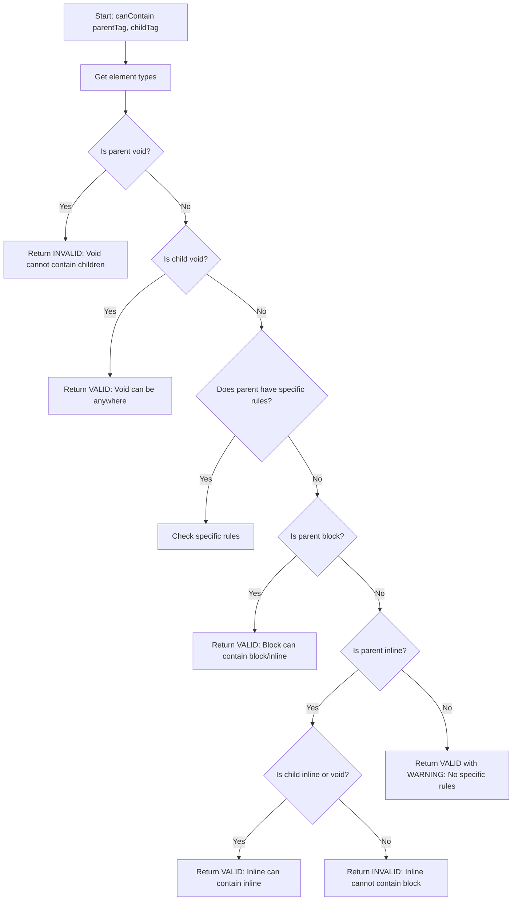

## Overview

The HTML Tags Checker uses a sophisticated validation algorithm implemented in the `canContain()` function to determine if one HTML element can contain another according to W3C standards.

<Info>
  **Core Function**: `canContain(parentTag, childTag)` in `index.js:779-899` is the heart of the validation engine.
</Info>

## Validation Algorithm Flow

The validator follows a specific order of checks, with early returns for definitive cases:



## Step-by-Step Validation Process

### Step 1: Type Detection

The function first determines the element types using `getElementType()` from `index.js:762-776`:

```javascript
function canContain(parentTag, childTag) {
    const parentType = getElementType(parentTag);
    const childType = getElementType(childTag);
    const messages = translations[currentLang].messages;
    // ... validation logic
}
```

<CodeGroup>
```javascript Type Detection
function getElementType(tag) {
    if (htmlNestingRules.voidElements.includes(tag)) {
        return 'void';
    } else if (htmlNestingRules.specificRules[tag]) {
        return 'specific';
    } else if (htmlNestingRules.blockElements.includes(tag)) {
        return 'block';
    } else if (htmlNestingRules.inlineElements.includes(tag)) {
        return 'inline';
    } else {
        // Default to block for unknown elements
        return 'block';
    }
}
```
</CodeGroup>

### Step 2: Void Element Checks

The validator immediately handles void elements with high-priority checks.

#### Void as Parent (Always Invalid)

From `index.js:785-791`:

```javascript
// If parent is a void element, it cannot contain anything
if (parentType === 'void') {
    return {
        valid: false,
        message: messages.voidParent.replace('{parent}', parentTag),
        warning: false
    };
}
```

<Warning>
  **Void elements cannot be parents**: Elements like ``, `<br>`, `<input>` cannot contain any children.
</Warning>

**Example:**
```javascript
canContain('img', 'span')
// Returns: { valid: false, message: "The  tag is a void element and cannot contain child elements." }
```

#### Void as Child (Always Valid)

From `index.js:794-800`:

```javascript
// If child is a void element, it can be in almost any location
if (childType === 'void') {
    return {
        valid: true,
        message: messages.voidChild.replace('{parent}', parentTag).replace('{child}', childTag),
        warning: false
    };
}
```

<Check>
  **Void elements can be children**: Void elements like `<br>`, ``, `<hr>` can appear in most contexts.
</Check>

**Example:**
```javascript
canContain('p', 'br')
// Returns: { valid: true, message: "The <p> tag can contain the void element <br>." }
```

### Step 3: Specific Rules Processing

Elements with specific nesting rules are handled with custom logic. From `index.js:803-857`:

```javascript
// If parent has specific rules
if (parentType === 'specific') {
    const allowedTypes = htmlNestingRules.specificRules[parentTag];
    
    // Check if child is explicitly allowed
    if (allowedTypes.includes(childTag)) {
        return {
            valid: true,
            message: messages.specificAllowed.replace('{parent}', parentTag).replace('{child}', childTag),
            warning: false
        };
    }
    
    // Check if child type is allowed
    if (allowedTypes.includes(childType)) {
        return {
            valid: true,
            message: messages.typeAllowed
                .replace('{parent}', parentTag)
                .replace('{child}', childTag)
                .replace('{type}', messages.elementType[childType]),
            warning: false
        };
    }
    
    // Special cases for interactive elements...
}
```

<Tabs>
  <Tab title="Explicit Tag Match">
    First checks if the child tag name is explicitly listed in allowed types.
    
    **Example:**
    ```javascript
    'table': ['caption', 'colgroup', 'thead', 'tbody', 'tfoot', 'tr']
    
    canContain('table', 'thead')
    // 'thead' is explicitly in the allowed list → VALID
    ```
  </Tab>
  
  <Tab title="Type Match">
    Then checks if the child's type (block/inline) is in the allowed types.
    
    **Example:**
    ```javascript
    'p': ['inline']
    
    canContain('p', 'span')
    // 'span' is inline type, 'inline' is allowed → VALID
    ```
  </Tab>
</Tabs>

#### Special Cases for Interactive Elements

The validator has explicit checks for elements that cannot contain block elements:

<CodeGroup>
```javascript Anchor <a> Element
if (parentTag === 'a' && childType === 'block') {
    return {
        valid: false,
        message: messages.aBlock.replace('{parent}', parentTag).replace('{child}', childTag),
        warning: false
    };
}
```

```javascript Button Element
if (parentTag === 'button' && childType === 'block') {
    return {
        valid: false,
        message: messages.buttonBlock.replace('{parent}', parentTag).replace('{child}', childTag),
        warning: false
    };
}
```

```javascript Label Element
if (parentTag === 'label' && childType === 'block') {
    return {
        valid: false,
        message: messages.labelBlock.replace('{parent}', parentTag).replace('{child}', childTag),
        warning: false
    };
}
```
</CodeGroup>

**From `index.js:828-850`:**

<Note>
  These special cases enforce that interactive elements (`<a>`, `<button>`, `<label>`) cannot contain block-level elements, even though their specific rules allow 'inline' and 'text'.
</Note>

**Example:**
```javascript
canContain('button', 'div')
// Returns: { valid: false, message: "The <button> tag cannot contain block elements like <div>..." }
```

#### Default Rejection for Specific Rules

If an element has specific rules but the child doesn't match, it's rejected:

```javascript
// From index.js:852-857
return {
    valid: false,
    message: messages.specificNotAllowed.replace('{parent}', parentTag).replace('{child}', childTag),
    warning: false
};
```

### Step 4: Block Element Rules

Block elements follow general rules allowing both block and inline children. From `index.js:860-867`:

```javascript
// General rules for block elements
if (parentType === 'block') {
    // Block elements can contain block or inline elements
    return {
        valid: true,
        message: messages.blockCanContain.replace('{parent}', parentTag).replace('{child}', childTag),
        warning: false
    };
}
```

<Check>
  **Block flexibility**: Most block elements (`<div>`, `<section>`, `<article>`) can contain any block or inline elements.
</Check>

**Example:**
```javascript
canContain('div', 'section')
// Returns: { valid: true, message: "The <div> tag is a block element and can contain block or inline elements like <section>." }

canContain('article', 'p')
// Returns: { valid: true, message: "The <article> tag is a block element and can contain block or inline elements like <p>." }
```

### Step 5: Inline Element Rules

Inline elements have strict restrictions. From `index.js:870-891`:

```javascript
// General rules for inline elements
if (parentType === 'inline') {
    // Inline elements can only contain inline elements or text
    if (childType === 'inline') {
        return {
            valid: true,
            message: messages.inlineCanContain.replace('{parent}', parentTag).replace('{child}', childTag),
            warning: false
        };
    } else if (childType === 'void') {
        return {
            valid: true,
            message: messages.inlineCanContainVoid.replace('{parent}', parentTag).replace('{child}', childTag),
            warning: false
        };
    } else {
        return {
            valid: false,
            message: messages.inlineCannotContain.replace('{parent}', parentTag).replace('{child}', childTag),
            warning: false
        };
    }
}
```

<Warning>
  **Inline restriction**: Inline elements can only contain other inline or void elements, never block elements.
</Warning>

**Examples:**
```javascript
canContain('span', 'strong')
// Returns: { valid: true, message: "The <span> tag is an inline element and can contain other inline elements like <strong>." }

canContain('span', 'br')
// Returns: { valid: true, message: "The <span> tag is an inline element and can contain void elements like <br>." }

canContain('span', 'div')
// Returns: { valid: false, message: "The <span> tag is an inline element and cannot contain block elements like <div>..." }
```

### Step 6: Default Fallback

If no specific rules match, the validator allows the nesting with a warning. From `index.js:894-898`:

```javascript
// Default case
return {
    valid: true,
    message: messages.noSpecificRules.replace('{parent}', parentTag).replace('{child}', childTag),
    warning: true
};
```

<Info>
  **Graceful degradation**: Unknown or edge cases are allowed with a warning flag, rather than blocking potentially valid HTML.
</Info>

## Return Object Structure

Every validation returns a consistent object structure:

```typescript
interface ValidationResult {
    valid: boolean;      // Is the nesting allowed?
    message: string;     // Descriptive message explaining the result
    warning: boolean;    // Is this a warning case? (valid but uncertain)
}
```

<CardGroup cols={3}>
  <Card title="Valid" icon="check">
    `{ valid: true, warning: false }`
    
    Nesting is explicitly allowed by HTML5 standards.
  </Card>
  
  <Card title="Invalid" icon="xmark">
    `{ valid: false, warning: false }`
    
    Nesting violates HTML5 standards.
  </Card>
  
  <Card title="Warning" icon="triangle-exclamation">
    `{ valid: true, warning: true }`
    
    No specific rules found, but allowed as fallback.
  </Card>
</CardGroup>

## Message Localization

All validation messages support internationalization through the `translations` object:

```javascript
const messages = translations[currentLang].messages;
```

Messages use template replacement for dynamic content:

```javascript
message: messages.voidParent.replace('{parent}', parentTag)
message: messages.blockCanContain.replace('{parent}', parentTag).replace('{child}', childTag)
```

**Available message templates from `index.js:78-96`:**

<AccordionGroup>
  <Accordion title="View All Message Templates">
    - `voidParent` - Parent is void element
    - `voidChild` - Child is void element
    - `specificAllowed` - Specific rule allows this
    - `typeAllowed` - Type-based rule allows this
    - `aBlock` - Anchor cannot contain block
    - `buttonBlock` - Button cannot contain block
    - `labelBlock` - Label cannot contain block
    - `specificNotAllowed` - Specific rule forbids this
    - `blockCanContain` - Block can contain this
    - `inlineCanContain` - Inline can contain inline
    - `inlineCanContainVoid` - Inline can contain void
    - `inlineCannotContain` - Inline cannot contain block
    - `noSpecificRules` - No specific rules found
  </Accordion>
</AccordionGroup>

## Real-World Examples

Let's trace through some common validation scenarios:

### Example 1: Paragraph Containing Strong

```javascript
canContain('p', 'strong')
```

<Steps>
  <Step title="Type Detection">
    - `parentType` = 'specific' (p has specific rules)
    - `childType` = 'inline'
  </Step>
  
  <Step title="Void Checks">
    - Neither is void, continue
  </Step>
  
  <Step title="Specific Rules">
    - `allowedTypes` = ['inline'] (from index.js:570)
    - Check: 'strong' in ['inline']? No
    - Check: 'inline' in ['inline']? **Yes!**
  </Step>
  
  <Step title="Result">
    ```javascript
    {
      valid: true,
      message: "The <p> tag can contain inline elements like <strong>.",
      warning: false
    }
    ```
  </Step>
</Steps>

### Example 2: Paragraph Containing Div (Invalid)

```javascript
canContain('p', 'div')
```

<Steps>
  <Step title="Type Detection">
    - `parentType` = 'specific'
    - `childType` = 'block'
  </Step>
  
  <Step title="Void Checks">
    - Neither is void, continue
  </Step>
  
  <Step title="Specific Rules">
    - `allowedTypes` = ['inline']
    - Check: 'div' in ['inline']? No
    - Check: 'block' in ['inline']? No
    - No match, fall through to rejection
  </Step>
  
  <Step title="Result">
    ```javascript
    {
      valid: false,
      message: "The <p> tag cannot contain <div> according to specific HTML5 rules.",
      warning: false
    }
    ```
  </Step>
</Steps>

### Example 3: Image in Any Context

```javascript
canContain('div', 'img')
```

<Steps>
  <Step title="Type Detection">
    - `parentType` = 'block'
    - `childType` = 'void'
  </Step>
  
  <Step title="Void Checks">
    - Parent is not void
    - Child IS void → **Early return!**
  </Step>
  
  <Step title="Result">
    ```javascript
    {
      valid: true,
      message: "The <div> tag can contain the void element .",
      warning: false
    }
    ```
  </Step>
</Steps>

### Example 4: Button Containing Div (Invalid)

```javascript
canContain('button', 'div')
```

<Steps>
  <Step title="Type Detection">
    - `parentType` = 'specific'
    - `childType` = 'block'
  </Step>
  
  <Step title="Void Checks">
    - Neither is void, continue
  </Step>
  
  <Step title="Specific Rules">
    - `allowedTypes` = ['inline', 'text']
    - Special case check: **parentTag === 'button' && childType === 'block'**
    - Triggers explicit rejection (index.js:836-842)
  </Step>
  
  <Step title="Result">
    ```javascript
    {
      valid: false,
      message: "The <button> tag cannot contain block elements like <div> according to HTML5 standards.",
      warning: false
    }
    ```
  </Step>
</Steps>

## Performance Considerations

The validation algorithm is optimized for speed:

<CardGroup cols={2}>
  <Card title="Early Returns" icon="bolt">
    Void element checks happen first, avoiding unnecessary processing for common cases
  </Card>
  
  <Card title="Array Lookups" icon="list">
    Element type detection uses simple array `.includes()` checks
  </Card>
  
  <Card title="No DOM Parsing" icon="code">
    Pure JavaScript logic without DOM manipulation
  </Card>
  
  <Card title="Cached Types" icon="database">
    Element categories are defined once in `htmlNestingRules`
  </Card>
</CardGroup>

## Validation Decision Tree

Here's a complete decision tree for the algorithm:

```
┌─────────────────────────────────┐
│  canContain(parent, child)      │
└────────────┬────────────────────┘
             │
             ▼
      ┌──────────────┐
      │ Parent void? │───Yes──→ ❌ INVALID
      └──────┬───────┘
             │ No
             ▼
      ┌──────────────┐
      │ Child void?  │───Yes──→ ✅ VALID
      └──────┬───────┘
             │ No
             ▼
      ┌──────────────────┐
      │ Parent specific? │
      └──────┬───────────┘
             │ Yes
             ▼
      ┌──────────────────────┐
      │ Child tag in rules?  │───Yes──→ ✅ VALID
      └──────┬───────────────┘
             │ No
             ▼
      ┌──────────────────────┐
      │ Child type in rules? │───Yes──→ ✅ VALID
      └──────┬───────────────┘
             │ No
             ▼
      ┌──────────────────────────┐
      │ Is <a>/<button>/<label>  │
      │ trying to contain block? │───Yes──→ ❌ INVALID
      └──────┬───────────────────┘
             │ No
             ▼
           ❌ INVALID (no match)
             
      [Back to "Parent specific?" = No branch]
             │
             ▼
      ┌──────────────┐
      │ Parent block?│───Yes──→ ✅ VALID
      └──────┬───────┘
             │ No
             ▼
      ┌───────────────┐
      │ Parent inline?│
      └──────┬────────┘
             │ Yes
             ▼
      ┌────────────────────┐
      │ Child inline/void? │───Yes──→ ✅ VALID
      └────────┬───────────┘
             │ No
             ▼
           ❌ INVALID
             
      [Back to "Parent inline?" = No branch]
             │
             ▼
           ⚠️  VALID with WARNING
```

## Next Steps

<CardGroup cols={2}>
  <Card title="HTML Nesting Rules" icon="layers" href="/concepts/html-nesting-rules">
    Learn about specific element nesting rules
  </Card>
  
  <Card title="Element Categories" icon="grid" href="/concepts/element-categories">
    Understand block, inline, and void element types
  </Card>
</CardGroup>