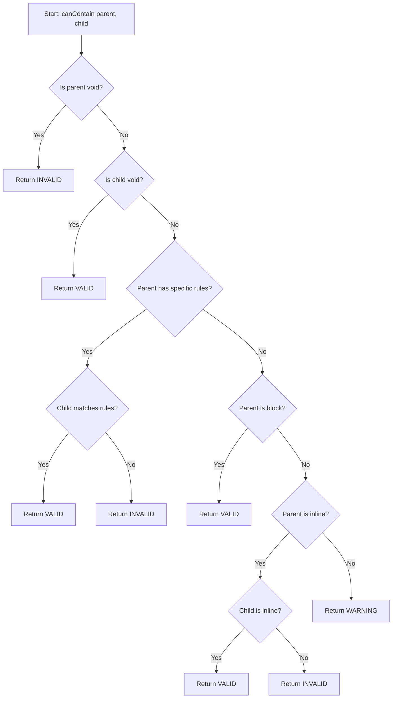

## Project Overview

HTML Tags Checker is a client-side web application built with vanilla HTML, CSS, and JavaScript. The project has a simple, educational structure that's easy to understand and modify.

## File Structure

```
html-tags-checker/
├── index.html          # Main HTML structure and UI
├── index.js            # JavaScript logic and validation
├── styles.css          # All styling and animations
├── readme.md           # Project information
└── LICENSE             # MIT License
```

<Note>
No build tools, frameworks, or dependencies required - just open `index.html` in a browser!
</Note>

## Core Files Breakdown

### index.html

**Purpose**: Defines the complete UI structure and layout

**Key Sections**:

<AccordionGroup>
  <Accordion title="Document Head">
    - UTF-8 charset and viewport configuration
    - Google Fonts (Inter) for modern typography
    - External CSS and JS file references
    - Deferred script loading for performance
  </Accordion>

  <Accordion title="Language Selector">
    ```html
    <div class="language-selector">
        <button class="language-option active" data-lang="es">ES</button>
        <button class="language-option" data-lang="en">EN</button>
    </div>
    ```
    
    - Positioned in top-right corner
    - Uses `data-lang` attributes for language switching
    - ARIA attributes for accessibility (`aria-pressed`)
  </Accordion>

  <Accordion title="Main Container">
    - **Header**: Title, subtitle, and rules button
    - **Form**: Parent tag and child tag inputs with validation
    - **Result Section**: Dynamic validation feedback with examples
    - **Footer**: Credits and W3C standards link
  </Accordion>

  <Accordion title="Modal Dialog">
    ```html
    <div class="modal-overlay" id="modalOverlay" hidden>
        <div class="modal" role="dialog" aria-modal="true">
            <!-- Header, Body, Footer -->
        </div>
    </div>
    ```
    
    - Displays comprehensive HTML nesting rules
    - Content generated dynamically via JavaScript
    - Fully accessible with proper ARIA attributes
    - Focus trap implementation for keyboard navigation
  </Accordion>
</AccordionGroup>

**Internationalization (i18n)**:
- Uses `data-i18n` attributes for translatable content
- Example: `<h1 data-i18n="title">HTML Tag Validator</h1>`
- Allows dynamic language switching without page reload

### index.js

**Purpose**: Contains all application logic, validation rules, and interactivity

**Architecture**: ~1030 lines organized into logical sections

<Steps>
  <Step title="Translations System (Lines 1-98)">
    **Structure**:
    ```javascript
    const translations = {
        es: { /* Spanish translations */ },
        en: { /* English translations */ }
    };
    ```
    
    **Contains**:
    - UI labels and messages
    - Validation feedback messages
    - Modal content structures
    - Dynamic message templates with placeholders
  </Step>

  <Step title="HTML Rendering Utilities (Lines 100-538)">
    **Key Functions**:
    - `escapeHtml(str)`: Prevents XSS attacks by escaping HTML characters
    - `renderCodeBlock(code)`: Generates syntax-highlighted code examples
    - `renderModalGuideHtml(lang)`: Creates comprehensive rules documentation
    
    **Modal Content Generation**:
    - Table of contents
    - Element categories (block, inline, void)
    - Specific nesting rules by element type
    - Best practices and validation tools
    - Over 400 lines of structured educational content
  </Step>

  <Step title="Validation Engine (Lines 540-603)">
    **Core Data Structure**:
    ```javascript
    const htmlNestingRules = {
        blockElements: [...],    // Elements that create block layout
        inlineElements: [...],   // Elements that flow with text
        voidElements: [...],     // Self-closing elements
        specificRules: {...}     // Element-specific nesting rules
    };
    ```
    
    **Element Categories**:
    - **Block Elements** (33 elements): `div`, `section`, `article`, `header`, etc.
    - **Inline Elements** (31 elements): `span`, `a`, `strong`, `em`, etc.
    - **Void Elements** (15 elements): `img`, `br`, `input`, `hr`, etc.
    - **Specific Rules**: 30+ elements with custom validation logic
  </Step>

  <Step title="Internationalization Logic (Lines 606-658)">
    **Function**: `changeLanguage(lang)`
    
    **Responsibilities**:
    - Updates `document.documentElement.lang`
    - Replaces all `[data-i18n]` content
    - Updates ARIA labels dynamically
    - Refreshes modal content if open
    - Re-validates current results in new language
  </Step>

  <Step title="Modal Management (Lines 660-760)">
    **Functions**:
    - `openModal()`: Shows rules dialog with focus management
    - `closeModal()`: Hides dialog and restores focus
    - `updateModalContent()`: Regenerates modal HTML
    - `setBackgroundInert()`: Manages inert attribute for accessibility
    - `getFocusableElements()`: Finds tabbable elements
    
    **Accessibility Features**:
    - Focus trap (Tab key handling)
    - Escape key to close
    - Background inert when modal is open
    - Returns focus to trigger button on close
  </Step>

  <Step title="Validation Logic (Lines 762-899)">
    **Function**: `canContain(parentTag, childTag)`
    
    **Validation Flow**:
    1. Determine element types (void, specific, block, inline)
    2. Check if parent is void element (cannot contain anything)
    3. Check if child is void element (can go almost anywhere)
    4. Apply specific rules if parent has custom restrictions
    5. Apply general block/inline nesting rules
    6. Return validation result with message and warning flag
    
    **Return Object**:
    ```javascript
    {
        valid: boolean,
        message: string,
        warning: boolean
    }
    ```
  </Step>

  <Step title="UI Display Logic (Lines 901-945)">
    **Function**: `showResult(parentTag, childTag, validation)`
    
    **Visual States**:
    - **Valid** (green): Allowed nesting
    - **Invalid** (red): Not allowed per HTML5 standards
    - **Warning** (yellow): Allowed with caveats
    
    **Dynamic Content**:
    - Result icon (✓, ✗, ⚠)
    - Validation message
    - Code example (valid or commented as invalid)
    - Smooth fade-in animation
  </Step>

  <Step title="URL Parameter Handling (Lines 947-964)">
    **Functions**:
    - `getUrlParams()`: Reads `parent`, `child`, `lang` from URL
    - `updateUrlParams()`: Updates URL without page reload
    
    **Use Case**: Shareable validation links
    - Example: `?parent=div&child=p&lang=en`
  </Step>

  <Step title="Event Handlers (Lines 966-1030)">
    **Form Submission**:
    - Validates input fields
    - Calls validation engine
    - Displays results
    - Updates URL parameters
    
    **Language Switching**:
    - Handles button clicks
    - Changes active state
    - Updates all UI text
    
    **Modal Interactions**:
    - Opens on rules button click
    - Closes on close button, overlay click, or Escape key
    
    **Page Load**:
    - Reads URL parameters
    - Sets default language (browser-based or Spanish)
    - Auto-validates if parameters present
  </Step>
</Steps>

### styles.css

**Purpose**: Complete styling, theming, animations, and responsive design

**Organization**: 700 lines structured by component

<CardGroup cols={2}>
  <Card title="CSS Variables" icon="palette">
    **Custom Properties** (Lines 1-16):
    - Colors (primary, success, error, warning)
    - Background and text colors
    - Border and shadow styles
    - Focus ring styling
    - Modal overlay transparency
  </Card>

  <Card title="Base Styles" icon="foundation">
    **Global Setup** (Lines 18-35):
    - Box-sizing reset
    - Inter font family
    - Body background and text
    - Smooth transitions
    - Optimized text rendering
  </Card>

  <Card title="Component Styles" icon="layer-group">
    **Major Components**:
    - Container and layout (Lines 37-46)
    - Header and title (Lines 48-65)
    - Language selector (Lines 83-116)
    - Form inputs (Lines 160-211)
    - Buttons with ripple effect (Lines 219-264)
    - Result cards (Lines 266-326)
    - Modal dialog (Lines 347-623)
  </Card>

  <Card title="Accessibility" icon="universal-access">
    **Features**:
    - Focus-visible styles with ring
    - ARIA-compliant interactions
    - Keyboard navigation support
    - Reduced motion support (Lines 690-700)
    - Sufficient color contrast
    - Hidden attribute support
  </Card>
</CardGroup>

**Animations** (Lines 625-657):
- `fadeInDown`: Header entrance
- `fadeInUp`: Card entrance
- `fadeIn`: General fade-in
- Ripple effect on buttons
- Smooth hover transitions

**Responsive Design** (Lines 659-688):
- Mobile breakpoint at 640px
- Adjusted font sizes and spacing
- Repositioned language selector
- Full-width modal on small screens
- Touch-friendly tap targets

## Code Organization Patterns

### Naming Conventions

<CodeGroup>
```javascript JavaScript Variables
// camelCase for variables and functions
const htmlNestingRules = {};
function canContain(parent, child) {}
let currentLang = 'es';
```

```css CSS Classes
/* kebab-case for CSS classes */
.language-selector {}
.modal-overlay {}
.result-icon {}
```

```html HTML Attributes
<!-- data-* for custom attributes -->
<button data-lang="es" data-i18n="title">
<!-- aria-* for accessibility -->
<div role="dialog" aria-modal="true">
```
</CodeGroup>

### Modular Functions

The code follows a **single responsibility principle**:

- **One function = One task**
- **Pure functions** where possible (no side effects)
- **Clear input/output** contracts
- **Reusable utilities** (escapeHtml, renderCodeBlock)

### State Management

**Simple Global State**:
```javascript
let currentLang = 'es';  // Current UI language
let lastFocusedElement = null;  // For focus restoration
let modalKeydownHandler = null;  // Modal event listener reference
```

<Warning>
No complex state management needed - this is a simple, educational application.
</Warning>

## Key Algorithms

### Tag Validation Algorithm



### Focus Trap Implementation

The modal uses a **keyboard focus trap** to ensure accessibility:

1. On modal open, store the previously focused element
2. Focus the close button
3. Find all focusable elements within the modal
4. On Tab: if at last element, cycle to first
5. On Shift+Tab: if at first element, cycle to last
6. On Escape or close: restore focus to original element

## Educational Design Patterns

### Progressive Enhancement

- **Works without JavaScript** (minimal degradation)
- **Accessible by default** (semantic HTML)
- **Enhanced with CSS** (visual appeal)
- **Interactive with JS** (validation and i18n)

### Learning-Friendly Code

- **Comments explain "why"**, not just "what"
- **Consistent formatting** for readability
- **Logical organization** by feature
- **Minimal abstractions** - keep it simple!
- **Clear variable names** that explain purpose

## Performance Considerations

- **No external dependencies** = fast load times
- **Deferred script loading** = non-blocking
- **CSS animations** = hardware accelerated
- **Efficient DOM queries** = cached where possible
- **Small file sizes** = ~50KB total uncompressed

## Browser Compatibility

Supports all modern browsers:
- Chrome/Edge (Chromium) 90+
- Firefox 88+
- Safari 14+
- Mobile browsers (iOS Safari, Chrome Android)

Uses modern JavaScript (ES6+):
- Arrow functions
- Template literals
- Const/let (no var)
- Array methods (map, filter, includes)
- String methods (replaceAll)

## Next Steps

Now that you understand the code structure:

1. **Explore the code** - open the files and read through
2. **Make a small change** - try adding a new translation
3. **Test your understanding** - add a new HTML element to the rules
4. **Contribute** - check the [Contributing Guide](/developer/contributing)

<Info>
The best way to learn is by doing - don't just read the code, modify it!
</Info>